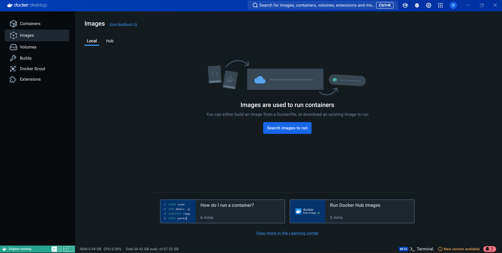
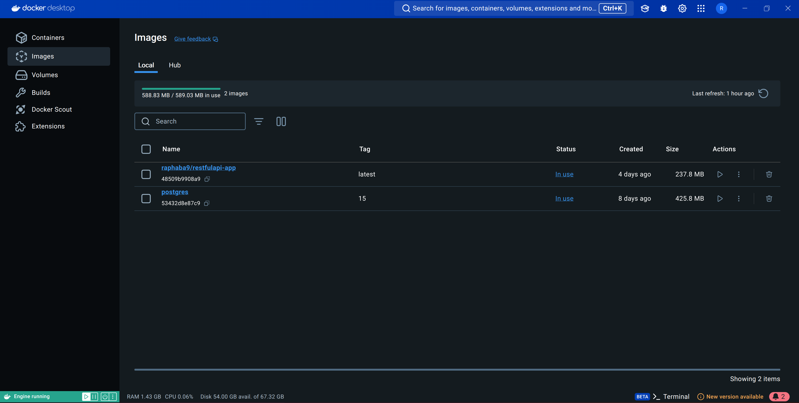
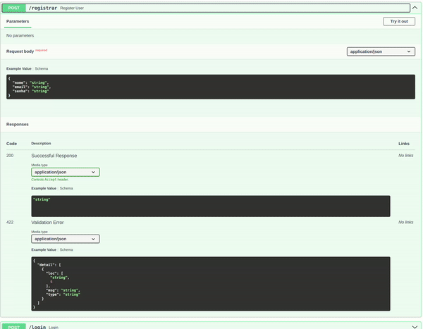
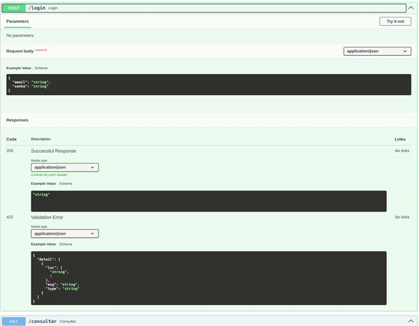
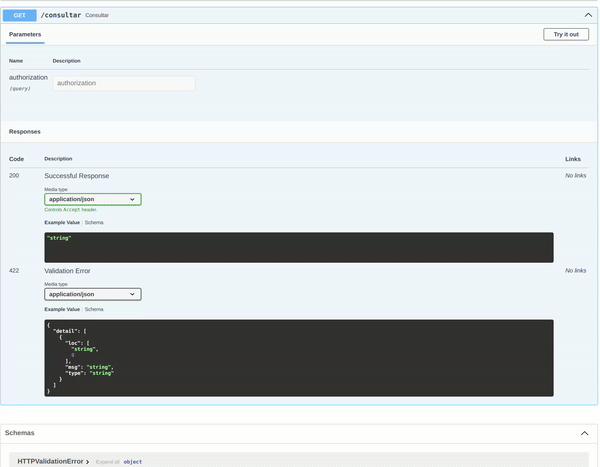

# Projeto Computação em Nuvem - Insper 2024.2
**Autoria de:** Raphael Cavalcanti Banov

**Link para o DockerHub do projeto:**
[Repositório Docker Hub](https://hub.docker.com/repository/docker/raphaba9/restfulapi-app/)

**Link para vídeo-demonstração da dockerização do projeto:**  [Vídeo-demonstração](https://youtu.be/HM9yQYtUGzY)

## 📄 Explicação do Projeto
O projeto se trata de uma API RESTful que é capaz de cadastrar e autenticar usuários. Logo, a API RESTful foi criada para validar a infraestrutura de um aplicativo. Após a construção da API, o projeto foi dockerizado e, então, implantado no AWS.

O endpoint de consulta utilizado é uma API de fatos/piadas envolvendo o artista marcial, ator, produtor de cinema e roteirista americano Chuck Norris.
Para saber mais sobre essa API, acesse [este link](https://api.chucknorris.io/).

# Como executar a api via Docker

## 0) Pré-requisitos

### Docker
Para executar a API, você precisará instalar o docker no seu sistema operacional, veja a instalação do docker para:
- [Windows](https://docs.docker.com/desktop/setup/install/windows-install/)
- [Mac-OS](https://docs.docker.com/desktop/setup/install/mac-install/)
- [Linux](https://docs.docker.com/desktop/setup/install/linux/)

### Postgres
É necessário, també configurar o framework da base de dados do **PostgreSQL**

Confira a instalação e configuração acessando a [documentação oficial](https://www.postgresql.org/download/).


## 1) Preparando o ambiente

### 1.1) Inicie o Docker em sua máquina


Não é necessário realizar login ou criar uma conta

### 1.2) Crie e acesse um novo diretório

```
$ mkdir novaPasta
$ cd novaPasta
```

### 1.3) Coloque o arquivo ```compose.yml``` no diretório criado

Baixe o arquivo, clicando [aqui](./compose.yaml)

Ou clone [este repositório](https://github.com/RaphaCBa9/RestfulAPI) do GitHub (caso possua git em sua máquina)

```git
$ git clone https://github.com/RaphaCBa9/RestfulAPI
```
O arquivo ``compose.yml`` estará na raiz do repositório.

## 2) Rode o docker compose

```bash
$ docker compose up --build
```

### 2.1) Verificando se rodou corretamente
Para conferir se o arquivo foi rodado corretamente:

a) Verifique a aba "Images" do seu Docker Desktop


b) Rode o comando:

```
$ docker images
```
A saída deve ser algo parecido com isso:
```
REPOSITORY                TAG       IMAGE ID       CREATED      SIZE
raphaba9/restfulapi-app   latest    48509b9908a9   4 days ago   238MB
postgres                  15        53432d8e87c9   8 days ago   426MB
```

## 3) Acesse a API e teste!

### 3.1) Testando via  FastAPI Swagger

Abra um navegador e acesse: http://0.0.0.0:8000/docs

### 3.2) Testando via CLI


### Endpoint ```./registrar```
Em um terminal, execute:

```
$ curl -X 'POST' \
  'http://0.0.0.0:8000/registrar' \
  -H 'accept: application/json' \
  -H 'Content-Type: application/json' \
  -d '{
  "nome": "Seu Nome",
  "email": "SeuEmail@exemplo.com",
  "senha": "SuaSenha"
}'
```
#### A saída esperada é:

```
{
  "jwt": "seuTokenDeAcesso"
}
```

### Endpoint ```./login```
```
curl -X 'POST' \
  'http://0.0.0.0:8000/login' \
  -H 'accept: application/json' \
  -H 'Content-Type: application/json' \
  -d '{
  "email": "seuEmailCadastrado@exemplo.com",
  "senha": "SuaSenha"
}'
```

#### A saída esperada é:

```
{
  "jwt": "seuTokenDeAcesso"
}
```
### Endpoint ```./consultar```

```
curl -X 'GET' \
  'http://0.0.0.0:8000/consultar?authorization=seuTokenDeAcesso' \
  -H 'accept: application/json'
```
## 4) Finalizando o conteiner
Para finalizar o conteiner do docker, rode o comando:
```
docker compose down --volumes
```
___

# Teste dos endpoints do projeto

### Registro de usuários


### Validação de usuários (Login)


### Consulta a API
